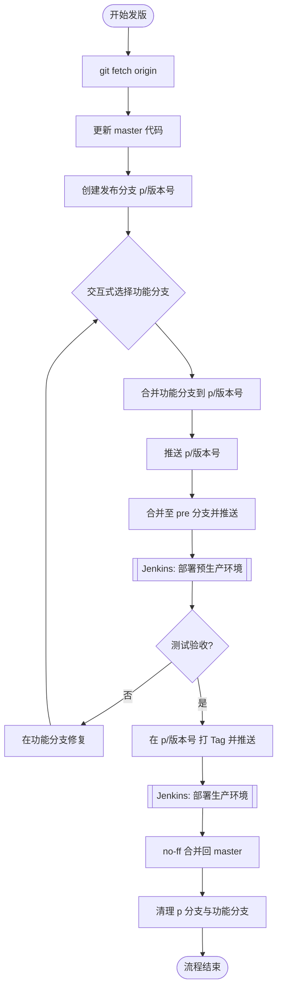

# Git Toolkit

这是一个用于自动化 Git 工作流的 CLI 工具。

## 1. 流程概述

本工具旨在自动化从“功能开发”到“预生产部署”再到“正式发版”的全流程 Git 操作，确保操作的一致性并减少人工错误。

## 2. 指令说明

| 指令 | 描述 | 对应 Git 操作 |
| :--- | :--- | :--- |
| `release start <version>` | 初始化发版分支并合并功能 | `fetch`, `pull master`, `checkout -b p/v`, `merge <features>`, `push` |
| `release pre` | 部署到预生产环境 | `checkout pre`, `pull`, `merge p/v`, `push` |
| `release prod` | 正式发版打标 | `tag -a`, `push --tags` |
| `release finish` | 完成发版并清理 | `checkout master`, `merge --no-ff p/v`, `push`, `branch -d` |

## 3. 核心优势

- **规范化**: 强制执行 `--no-ff` 合并回 `master`，保留完整的发布历史。
- **自动化**: 一键完成多分支合并和环境切换。
- **交互式**: 通过命令行界面直观选择要发布的功能分支。
- **安全性**: 每次操作前自动检查工作区状态，防止代码丢失。

## 4. 异常处理

- **合并冲突**: 脚本会检测冲突并停止，用户手动解决冲突并 commit 后，可再次运行指令。
- **环境检查**: 确保当前分支与操作指令匹配（例如 `release pre` 必须在 `p/` 分支执行）。

